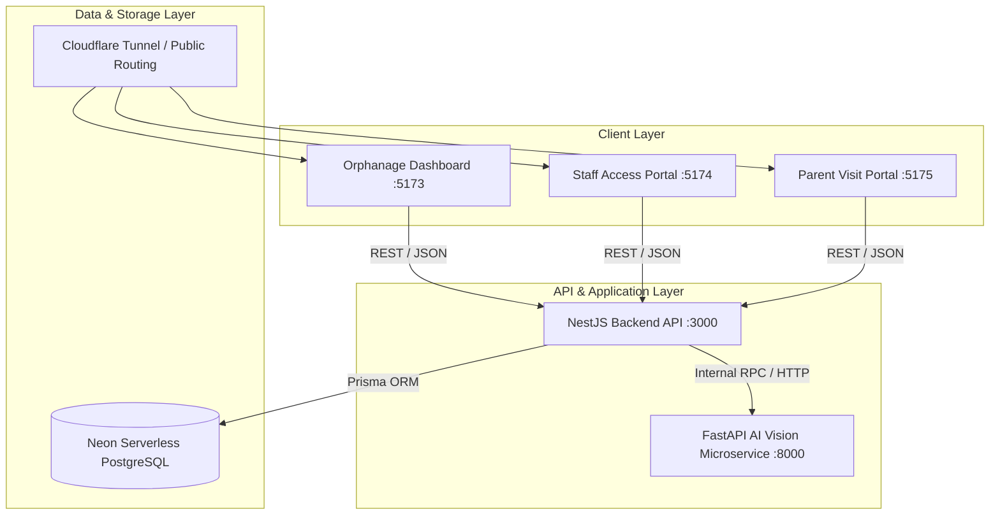

# Velora — System Architecture & Technical Specifications

## 1. Overview
**Velora** is an enterprise AI-assisted Child Safety and Orphanage Welfare Management SaaS platform designed to ensure child protection before, during, and after adoption. It provides end-to-end security through dual-mode Gate Access Control (Staff RFID & Parent Visit QR Passes), real-time presence audits, management analytics, and post-adoption AI welfare monitoring.

---

## 2. Multi-Tier Distributed Architecture

---

## 3. Technology Stack

| Layer | Technologies | Role / Responsibility |
| :--- | :--- | :--- |
| **Frontend Applications** | React 18, Vite, TailwindCSS, Framer Motion, Lucide/React-Icons | Main Admin Dashboard (`:5173`), Staff Portal (`:5174`), Parent Portal (`:5175`). |
| **Backend REST API** | NestJS, TypeScript, Node.js, Prisma ORM, Passport JWT | RBAC, Visit Lifecycles, NFC/QR Gate validation, Analytics aggregation, Audit trail. |
| **AI Vision Microservice** | Python 3.10+, FastAPI, InsightFace, OpenCV, PyTorch/ONNX | SCRFD 10G face detection, ArcFace 512D facial feature extraction & identity verification. |
| **Database** | Serverless Neon PostgreSQL | Relational storage for users, children, visits, gate movements, and welfare assessments. |
| **Conversational AI** | Web Speech Synthesis & SpeechRecognition | Bilingual (English/Hinglish) age-appropriate post-adoption welfare check-in dialogues. |
| **Public Gateway** | Cloudflare Tunnels (`cloudflared`) | Zero-trust public URLs for multi-device mobile scanning and external portal access. |

---

## 4. Subsystem Breakdown

### 4.1 Gate Control Center & Physical Access
- **Dual-Mode Authentication**: Integrates Staff RFID tag validation (`STF-001`) and dynamic Parent Visit QR passes (`NFC-VST-XXXXXX`).
- **Presence Engine**: Tracks active occupants inside premises in real time.
- **Overstay & Late Detection**: Flags visits exceeding approved time slots.

### 4.2 Post-Adoption AI Welfare Monitoring
- **Biometric Identity Check**: 512-dimensional ArcFace verification against enrolled child baseline.
- **Probabilistic Indicators**: Factual emotion/dialogue observations strictly presented as decision support without deterministic accusations.
- **Human Review Queue**: Authorized caseworkers review, log notes, and schedule follow-ups.

### 4.3 Management Analytics & Reporting
- Dynamic period aggregation (7D, 30D, 90D, 1Y) for visit volumes, peak gate hours, child demographics, and compliance records with sanitized CSV export.
