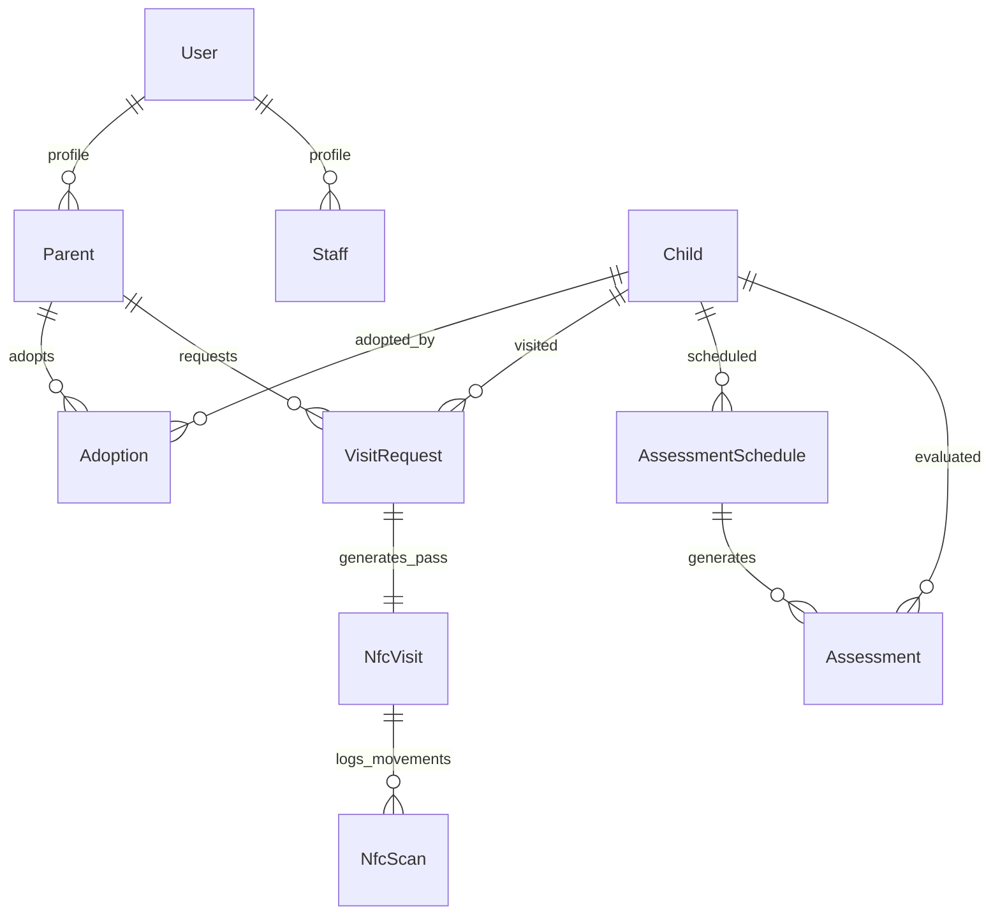

# Velora — Database Schema & Data Models

## 1. Overview
Velora uses **Neon Serverless PostgreSQL** with **Prisma ORM** for strong relational data integrity, parameterized queries, and ACID transactional guarantees.

---

## 2. Entity Relationship Model

---

## 3. Core Database Models

### 3.1 `User`
- `id` (UUID): Primary key.
- `email` (String, unique): User email.
- `passwordHash` (String): Secure bcrypt password hash.
- `role` (Enum): `ADMIN`, `ORPHANAGE`, `STAFF`, `PARENT`, `SOCIAL_WORKER`.
- `firstName`, `lastName`, `phone`: Identity details.

### 3.2 `Child`
- `id` (UUID): Primary key.
- `firstName`, `lastName`: Child name.
- `dob` / `approximateAge`: Age calculation.
- `gender`, `status`: `AVAILABLE`, `IN_PROCESS`, `ADOPTED`.
- `photo`: Enrolled baseline face photo.

### 3.3 `VisitRequest`
- `id` (UUID): Primary key.
- `parentId`, `childId`, `orphanageId`: Relational foreign keys.
- `visitDate`, `timeSlot`, `startTime`, `endTime`: Approved visit window.
- `status`: `PENDING`, `APPROVED`, `CHECKED_IN`, `CHECKED_OUT`, `COMPLETED`, `CANCELLED`, `REJECTED`.
- `purpose`, `notes`: Visit details.

### 3.4 `NfcVisit` & `NfcScan`
- `id` (UUID): Pass ID.
- `passCode` (String, unique): E.g. `NFC-VST-D3642D`.
- `secureToken` (String): Cryptographic pass verification token.
- `status`: `ACTIVE`, `INSIDE`, `COMPLETED`, `EXPIRED`.
- `NfcScan`: Append-only movement records (`ENTRY`, `EXIT`, `DENIED`).

### 3.5 `AssessmentSchedule` & `Assessment`
- `id` (UUID): Primary key.
- `childId`, `adoptionId`: Relational links.
- `nextAssessmentDate`, `frequencyMonths` (6 months).
- `overallScore`, `confidence`, `notes`: AI decision support observations.
